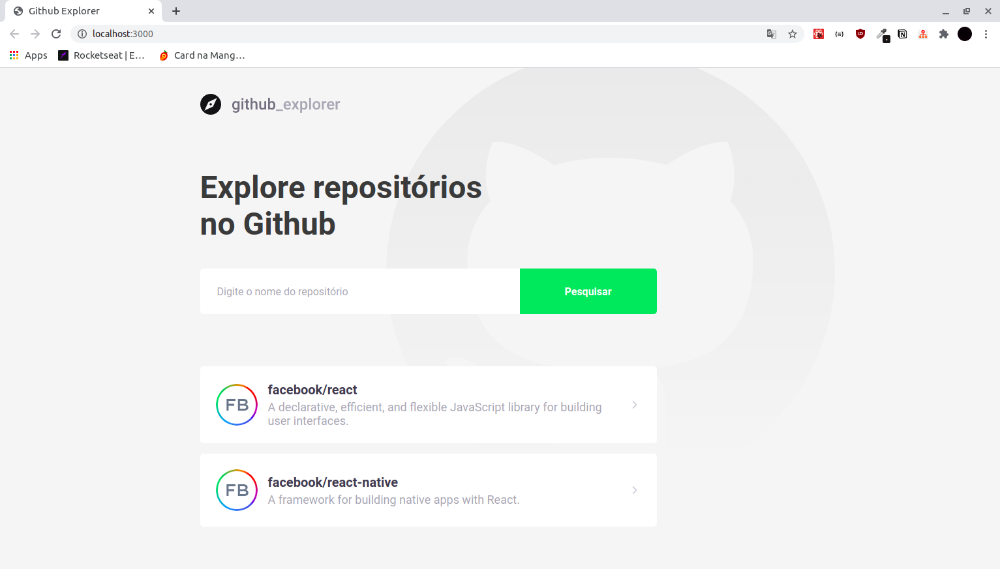
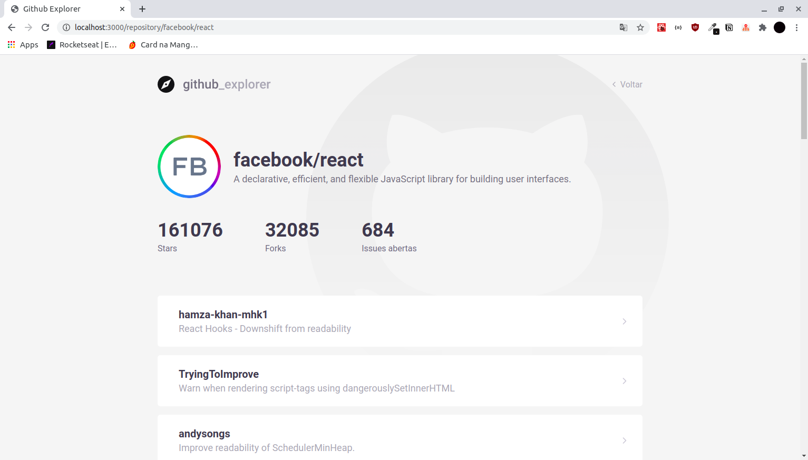

# Github Explorer


<h1 align="center">
  
</h1>

<h5 align="center">
  Explore repositórios do Github.
</h5>

## Primeiro Acesso
### Clonando o projeto
```
$ git clone https://github.com/matheusfd3/github-explorer.git
```
### Baixando as dependências
Na pasta do projeto execute o comando abaixo com o [Yarn](https://yarnpkg.com/lang/pt-br/).
```
$ yarn install
```
### Rodando no localhost
```
$ yarn start
```
Acesse [http://localhost:3000/](http://localhost:3000/).

## Páginas
### **Dashboard**
<h2 align="center">
  
</h2>

### **Repository**
<h2 align="center">
  
</h2>
